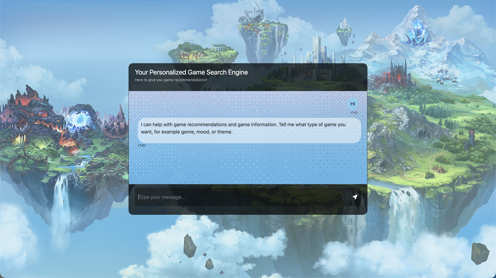

# RAG-Based Personalized Game Search Engine

## Project Snapshot

This is a conversational game discovery app built around retrieval-augmented generation (RAG). A user describes a game they want in natural language, the system retrieves the most relevant entries from a vector index, and an LLM produces a concise response grounded in that retrieved context.

## What Problem It Solves

Game search often depends on rigid filters. This project lets users describe intent (mood, mechanics, narrative themes) and still get grounded results, reducing the gap between how people think and how search engines operate.

## Core Ideas (At a Glance)

- **Semantic search**: Results are based on meaning, not just keywords. The embedding model captures similarity between concepts like “cozy crafting” or “story-rich sci-fi,” so the system can return relevant titles even when the exact words do not match.
- **RAG flow**: Retrieval provides context and the LLM formats the answer. The model is constrained to the retrieved snippets, which reduces hallucinations and keeps responses tied to the dataset.
- **Catalog scale**: Embeddings + Pinecone keep search fast at large scale. Vector search lets the system handle tens of thousands of games without slow, exhaustive filtering.
- **Simple UI**: A chat-style interface reduces friction. Users can ask in plain language and get a short, focused recommendation rather than a long list.

## Data Source and Preparation

- **Dataset**: Steam Games Dataset by Fronkon Games (Hugging Face), 85k+ titles.
- **Cleaning**:
  - Normalize text fields and handle missing values.
  - Combine title, genre, and description into a single text field.
  - Truncate metadata to fit vector database limits.

## System Walkthrough

### 1) Index Build Flow (Offline)

1. Load the dataset from Hugging Face.
2. Build a combined text string per game (title + genre + description).
3. Generate embeddings for each record.
4. Upsert vectors into Pinecone for retrieval.

### 2) Query Flow (Runtime)

1. Convert the user question into an embedding.
2. Retrieve top matches from Pinecone.
3. Build a prompt that includes the retrieved context.
4. Use Llama2 to generate a concise response.
5. Return the final recommendation to the UI.

## Combined Flow (ASCII)

```text
        (RUNTIME)                        (INDEX BUILD)

+-----------------------+               +---------------+
|     PLAYER INPUT      |               |  GAME CORPUS  |
+-----------+-----------+               +-------+-------+
            |                                   |
            v                                   v
+-----------------------+           +-----------------------+
|    NATURAL QUERY      |           |   INGEST + NORMALIZE  |
+-----------+-----------+           +-----------+-----------+
            |                         |                   |
            v                         v                   v
+-----------------------+     +-------------+         +-------------+
|     INTENT VECTORS    |     | TEXT CHUNKS |  . . .  | TEXT CHUNKS |
+-----------+-----------+     +-------------+         +-------------+
            |                             |             |
            v                             v             v
+-----------------------+              +------------------+
|     VECTOR STORE      | <- feeds +   | SEMANTIC VECTORS |
+-----------+-----------+          |   +--------+---------+
            |                      |            |
            v                      |            v
+-----------------------+          |  +--------------------+
|      TOP MATCHES      |          |  | INDEX CONSTRUCTION |
+-----------+-----------+          |  +----------+---------+
            |                      |             |
            v                      +-------------+
+-----------------------+                                      
|   RESPONSE ENGINE     |
|       (LLAMA2)        |
+-----------+-----------+
            |
            v
+-----------------------+
|    FINAL RESPONSE     |
+-----------------------+
```

## API Surface (Flask)

- `GET /` renders the chat UI.
- `POST /get` accepts form data with `msg` and returns the response string.

Example request (curl):

```bash
curl -X POST -d "msg=I want a story-driven sci-fi game" http://localhost:10000/get
```

## Example Queries

- "Looking for a cozy farming game with light combat"
- "Co-op horror game with short sessions"
- "Open world RPG with crafting and base building"
- "Narrative-heavy game set in space"

## Setup and Environment

### Requirements

- Python 3.9+
- A Pinecone account and index
- An LLM runtime for Llama2 (configured locally)


## Indexing Script Notes

The indexing flow is in [store_index.py](store_index.py). It builds vectors for the full dataset and uploads them to Pinecone. The delete step is intentionally commented out to prevent accidental index wipes. Uncomment only when you want a full refresh.

## Tech Stack

- **Python**: Simple, readable, and strong ecosystem for data handling, ML tooling, and web services.
- **Flask**: Lightweight framework that keeps the API surface small and easy to deploy.
- **LangChain**: Helps structure retrieval + prompting workflows and keeps the RAG pipeline modular.
- **Meta Llama2**: Provides high-quality natural-language responses for a conversational UI.
- **Pinecone**: Managed vector database that makes similarity search fast and reliable at scale.


## Planned Improvements

1. Taste profiles that evolve over time (long-term personalization).
2. Conversation-aware ranking that remembers the last few turns.
3. Hybrid search (semantic + keyword) for sharper results.
4. “Why this game” explanations tied to retrieved context.
5. Automated re-indexing pipeline for new releases.
6. Quality and latency monitoring with simple dashboards.
7. Community signals like ratings, reviews, and tags.
8. Real-time trends as a boost signal for fresh picks.
9. Faster batch indexing with parallel embedding.

## UI Preview



## Run Locally

1. Install dependencies: `pip install -r requirements.txt`.
2. Create a `.env` file in the project root and set your Pinecone key:

```
PINECONE_API_KEY=your_key_here
```

3. In [src/helper.py](src/helper.py), confirm the Pinecone index name and model settings:
  - `index = "gamerecommendationsystem"` should match your Pinecone index.
  - `llm = OllamaLLM(model="llama2")` should match the model you have locally.
4. (Optional) Build or refresh the index using [store_index.py](store_index.py). The delete step is commented out for safety.
5. Start the server: `python app.py`.
6. Open the app in your browser at `http://localhost:10000`.

## Support

If you have feedback, ideas, or run into issues, feel free to reach out at murthy.psty@gmail.com.